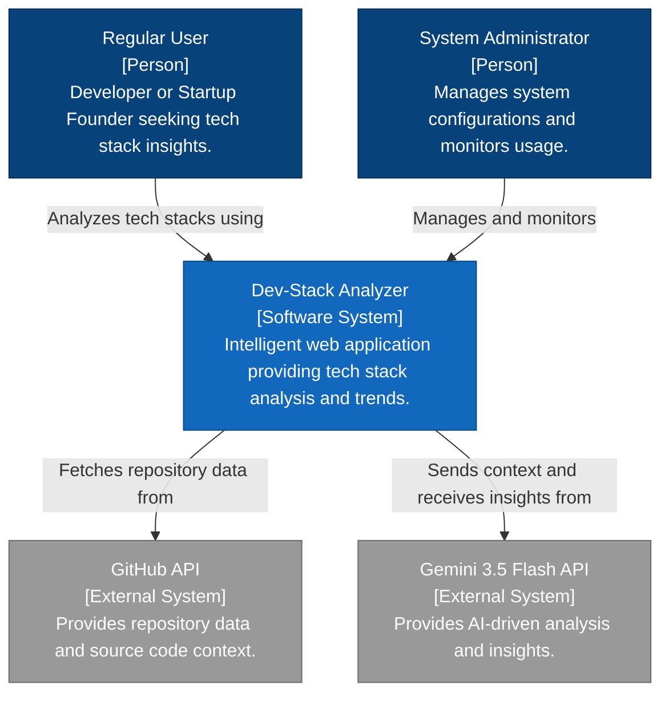
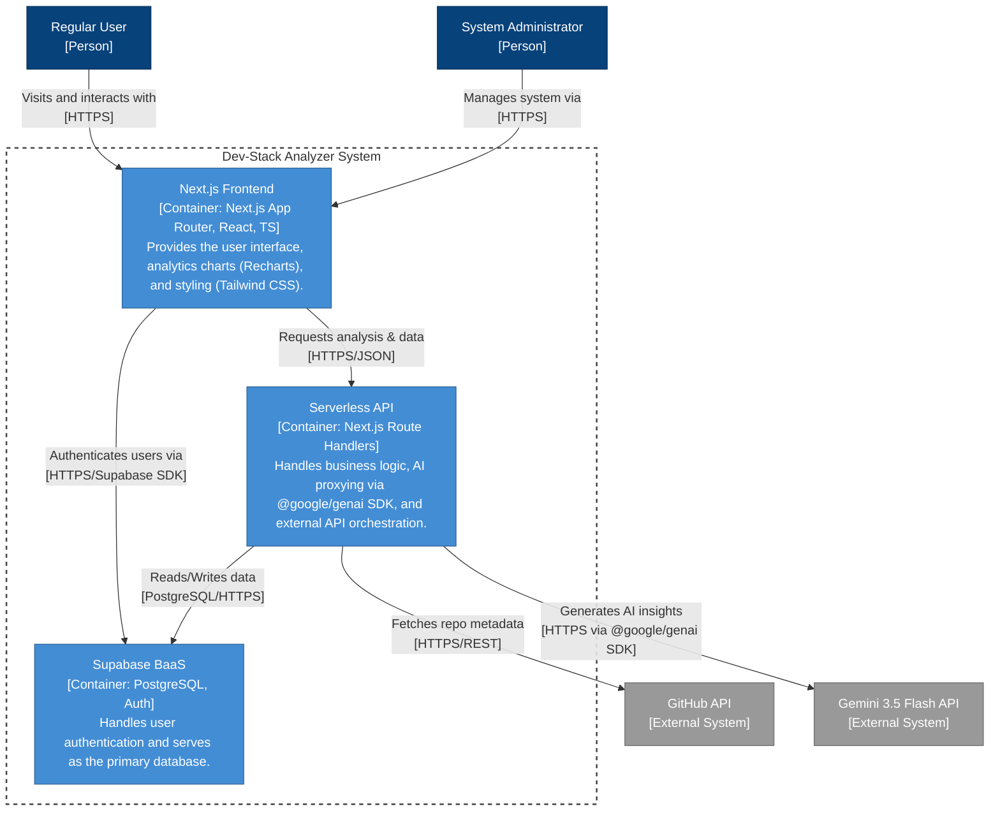
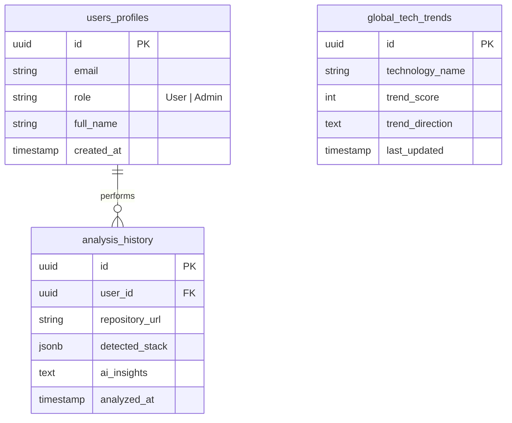

This is a [Next.js](https://nextjs.org) project bootstrapped with [`create-next-app`](https://nextjs.org/docs/app/api-reference/cli/create-next-app).

## Getting Started

First, run the development server:

```bash
npm run dev
# or
yarn dev
# or
pnpm dev
# or
bun dev
```

Open [http://localhost:3000](http://localhost:3000) with your browser to see the result.

You can start editing the page by modifying `app/page.tsx`. The page auto-updates as you edit the file.

This project uses [`next/font`](https://nextjs.org/docs/app/building-your-application/optimizing/fonts) to automatically optimize and load [Geist](https://vercel.com/font), a new font family for Vercel.

## Learn More

To learn more about Next.js, take a look at the following resources:

- [Next.js Documentation](https://nextjs.org/docs) - learn about Next.js features and API.
- [Learn Next.js](https://nextjs.org/learn) - an interactive Next.js tutorial.

You can check out [the Next.js GitHub repository](https://github.com/vercel/next.js) - your feedback and contributions are welcome!

## Deploy on Vercel

The easiest way to deploy your Next.js app is to use the [Vercel Platform](https://vercel.com/new?utm_medium=default-template&filter=next.js&utm_source=create-next-app&utm_campaign=create-next-app-readme) from the creators of Next.js.

Check out our [Next.js deployment documentation](https://nextjs.org/docs/app/building-your-application/deploying) for more details.

---

## 🏗️ System Architecture (C4 Model Verification)

> **Note:** The following diagrams were produced by a full reverse-engineering audit of the live source code. They reflect the **actual production implementation** — including runtime state synchronization fixes, Supabase singleton enforcement, and the GitHub→Gemini two-phase pipeline — and supersede any earlier planning documentation that drifted during development.

---

### Level 1 — System Context Diagram

Shows the outer boundary of the **Dev-Stack Analyzer** system and every external actor or third-party service it communicates with.

## Architectural Diagrams

### 1. C4 System Context Diagram



---

### 2. C4 Container Diagram



---

### 3. Entity Relationship Diagram (ERD)



---

### Architecture Decision Log

The following decisions deviated from the original planning spec and are reflected in the diagrams above:

| Decision | Original Plan | Actual Implementation | Reason |
| :--- | :--- | :--- | :--- |
| **Supabase Client** | `createClientComponentClient()` per-page | Single `supabase` singleton exported from `lib/supabase.ts` | Multiple GoTrueClient instances on the same browser storage key caused automatic logout on page navigation |
| **DB Insert Strategy** | `.upsert()` with `onConflict: repository_url` | `.insert()` with no `id` field | `repository_url` has no UNIQUE constraint; `id` is `gen_random_uuid()` PK — client must never supply it |
| **Race Condition Guard** | Read from React state after `setResult()` | Read directly from local `finalResult` / `finalResponse` variables before `setState` | `setState` is asynchronous; reading state immediately after setting yields stale `null` values |
| **GitHub Fallback** | Hard error returned to client | `isSimulated=true` → `fallbackPrompt` → Gemini estimates | Graceful degradation keeps the product useful even under API rate limits or private repos |
| **JSONB Stack Format** | `string[]` flat array | `TechBreakdownEntry[] ({ tech, percentage })` or `string[]` | History page implements dual-format parsing to stay backwards-compatible with older rows |

---

## 📊 Technical Architecture & UML Class Diagram

> The diagram below is synthesized from the live TypeScript source code. All field types and method signatures reflect the actual interfaces, state shapes, and function contracts present in the codebase. Four canonical UML relationship kinds are used: **Aggregation** (`o--`), **Composition** (`*--`), **Association / Dependency** (`-->`), and **Realization / Inheritance** (`<|--`).

```mermaid
classDiagram

    %% ─────────────────────────────────────────────
    %%  CORE SERVICE CLIENTS
    %% ─────────────────────────────────────────────

    class SupabaseClient {
        <<Singleton>>
        -supabaseUrl : string
        -supabaseAnonKey : string
        -instance : SupabaseClient
        +auth : GoTrueClient
        +from(table: string) QueryBuilder
        +getInstance() SupabaseClient$
    }

    class GitHubClient {
        -baseUrl : string
        -userAgent : string
        -authToken : string | undefined
        +fetchRepositoryStructure(owner: string, repo: string) Promise~FileEntry[]~
        +downloadManifestFile(downloadUrl: string) Promise~string~
        +buildAuthHeaders() Record~string_string~
    }

    class GeminiClient {
        -apiKey : string
        -modelName : string
        +generateStructuredAudit(prompt: string, systemInstruction: string) Promise~string~
        +parseJsonResponse(raw: string) AnalysisReport
        +isAvailable() boolean
    }

    %% ─────────────────────────────────────────────
    %%  ORCHESTRATOR  (API Route Controller Layer)
    %% ─────────────────────────────────────────────

    class AnalyzerOrchestrator {
        -githubClient : GitHubClient
        -geminiClient : GeminiClient
        -historyRepository : AnalysisHistoryRepository
        -isSimulated : boolean
        +handleAnalysisRequest(req: Request) Promise~NextResponse~
        +handleRepositoryScan(owner: string, repo: string, depth: string, targets: object) Promise~AnalysisReport~
        +handleConsultantQuery(promptText: string) Promise~ConsultResponse~
        +executeFallbackCircuitBreaker(owner: string, repo: string) Promise~AnalysisReport~
        -buildScanPrompt(fileTree: string, manifests: string, depth: string, targets: object) string
        -buildFallbackPrompt(owner: string, repo: string) string
        -getMockAnalysis(repositoryUrl: string, isSimulated: boolean) AnalysisReport
    }

    %% ─────────────────────────────────────────────
    %%  REPOSITORY  (Persistence Layer)
    %% ─────────────────────────────────────────────

    class AnalysisHistoryRepository {
        -supabase : SupabaseClient
        -tableName : string
        +saveRecord(userId: string, repositoryUrl: string, detectedStack: TechBreakdownItem[], aiInsights: string) Promise~void~
        +fetchUserHistory(userId: string) Promise~HistoricalScan[]~
        +mapRowToScan(row: DatabaseRow) HistoricalScan
        +parseTechStack(raw: unknown) TechBreakdownItem[]
    }

    %% ─────────────────────────────────────────────
    %%  DATA ENTITIES & VALUE OBJECTS
    %% ─────────────────────────────────────────────

    class UserSession {
        +userId : string
        +email : string
        +role : string
        +jwtToken : string
        +expiresAt : number
        +isAuthenticated() boolean
        +isExpired() boolean
    }

    class AnalysisReport {
        +reportId : string
        +repositoryUrl : string
        +owner : string
        +repo : string
        +detectedStack : string[]
        +securityScore : number
        +aiInsights : string
        +recommendations : string[]
        +markdownResponse : string
        +analyzedAt : Date
        +isSimulated : boolean
        +techBreakdown : TechBreakdownItem[]
        +trendMetrics : TrendMetric[]
        +getSummary() string
        +toJsonbPayload() object
    }

    class TechBreakdownItem {
        +techName : string
        +percentage : number
        +category : string
        +toChartEntry() object
    }

    class TrendMetric {
        +month : string
        +popularityScore : number
        +techKey : string
        +toChartDataPoint() object
    }

    class ConsultResponse {
        +markdownResponse : string
        +techBreakdownData : TechBreakdownItem[] | null
        +popularityTrendData : TrendMetric[] | null
        +truncateTitle(maxLength: number) string
    }

    class HistoricalScan {
        +id : string
        +repo : string
        +url : string
        +date : string
        +score : number
        +stack : string[]
        +insights : string
        +recommendations : string[]
    }

    class FileEntry {
        +name : string
        +type : string
        +downloadUrl : string | null
        +isManifest() boolean
    }

    %% ─────────────────────────────────────────────
    %%  ERROR HIERARCHY  (Realization / Inheritance)
    %% ─────────────────────────────────────────────

    class CustomAnalysisError {
        <<abstract>>
        +message : string
        +code : string
        +statusCode : number
        +timestamp : Date
        +toResponse() NextResponse
    }

    class TokenExpiredError {
        +userId : string
        +expiredAt : Date
        +refreshRequired : boolean
        +getRedirectPath() string
    }

    class GitHubRateLimitError {
        +resetAt : Date
        +requestsRemaining : number
        +triggersFallback : boolean
        +getRateLimitHeaders() Record~string_string~
    }

    class GeminiParseError {
        +rawResponse : string
        +parseAttempts : number
        +triggersStaticFallback : boolean
    }

    %% ─────────────────────────────────────────────
    %%  RELATIONSHIPS
    %% ─────────────────────────────────────────────

    %% — Aggregation: AnalyzerOrchestrator owns references to the three
    %%   service/repository objects but does NOT manage their lifecycles.
    %%   All three can exist independently (e.g. shared across routes).
    AnalyzerOrchestrator o-- GitHubClient : aggregates
    AnalyzerOrchestrator o-- GeminiClient : aggregates
    AnalyzerOrchestrator o-- AnalysisHistoryRepository : aggregates

    %% — Composition: TechBreakdownItem and TrendMetric only exist
    %%   as part of a specific AnalysisReport instance. Destroying
    %%   the report destroys its nested breakdown and trend data.
    AnalysisReport *-- TechBreakdownItem : composes
    AnalysisReport *-- TrendMetric : composes

    %% — Association / Dependency: AnalysisHistoryRepository depends
    %%   on SupabaseClient for all database I/O. It holds a direct
    %%   reference to the singleton instance.
    AnalysisHistoryRepository --> SupabaseClient : depends on

    %% — AnalyzerOrchestrator produces AnalysisReport and ConsultResponse
    AnalyzerOrchestrator --> AnalysisReport : produces
    AnalyzerOrchestrator --> ConsultResponse : produces

    %% — GitHubClient returns FileEntry value objects
    GitHubClient --> FileEntry : returns

    %% — AnalysisHistoryRepository produces HistoricalScan view models
    AnalysisHistoryRepository --> HistoricalScan : maps to

    %% — UserSession is resolved from SupabaseClient auth
    SupabaseClient --> UserSession : resolves

    %% — Realization / Inheritance: error hierarchy
    %%   TokenExpiredError, GitHubRateLimitError, and GeminiParseError
    %%   all inherit from the abstract CustomAnalysisError base.
    CustomAnalysisError <|-- TokenExpiredError : inherits
    CustomAnalysisError <|-- GitHubRateLimitError : inherits
    CustomAnalysisError <|-- GeminiParseError : inherits
```



### Class Relationship Reference

| Relationship | Arrow | Pair | Semantic Meaning |
| :--- | :---: | :--- | :--- |
| **Aggregation** | `o--` | `AnalyzerOrchestrator` → `GitHubClient` / `GeminiClient` / `AnalysisHistoryRepository` | The orchestrator consumes these services but does not own their lifecycle — they are module-level singletons that survive beyond any single request |
| **Aggregation** | `o--` | `AnalyzerOrchestrator` → `AnalysisHistoryRepository` | Repository is injected/referenced, not instantiated, inside the orchestrator |
| **Composition** | `*--` | `AnalysisReport` → `TechBreakdownItem` | Breakdown items are meaningless outside a report; they are created and destroyed together |
| **Composition** | `*--` | `AnalysisReport` → `TrendMetric` | Trend data points are tightly bound to a single report's context and share its lifecycle |
| **Dependency** | `-->` | `AnalysisHistoryRepository` → `SupabaseClient` | The repository holds a direct reference to the singleton client and delegates all I/O to it |
| **Dependency** | `-->` | `AnalyzerOrchestrator` → `AnalysisReport` / `ConsultResponse` | The orchestrator is the factory that constructs both response value objects |
| **Dependency** | `-->` | `SupabaseClient` → `UserSession` | GoTrue auth resolution returns a typed `UserSession` value object |
| **Inheritance** | `<|--` | `CustomAnalysisError` ← `TokenExpiredError` | Token expiry is a specialisation of the abstract error contract; adds redirect metadata |
| **Inheritance** | `<|--` | `CustomAnalysisError` ← `GitHubRateLimitError` | Rate-limit errors carry additional reset-time and fallback-trigger metadata |
| **Inheritance** | `<|--` | `CustomAnalysisError` ← `GeminiParseError` | JSON parse failures from the LLM are a distinct error class that triggers static fallback |


