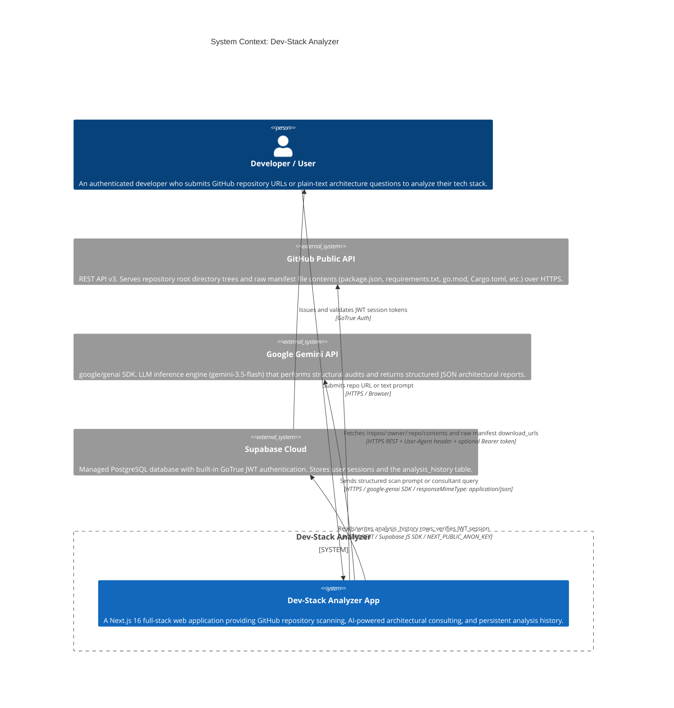
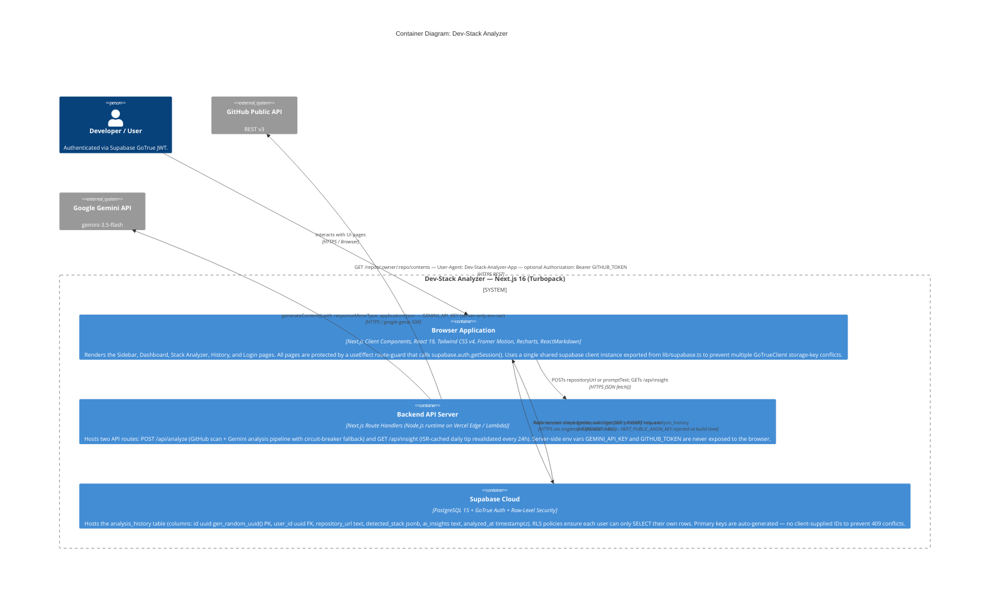

This is a [Next.js](https://nextjs.org) project bootstrapped with [`create-next-app`](https://nextjs.org/docs/app/api-reference/cli/create-next-app).

## Getting Started

First, run the development server:

```bash
npm run dev
# or
yarn dev
# or
pnpm dev
# or
bun dev
```

Open [http://localhost:3000](http://localhost:3000) with your browser to see the result.

You can start editing the page by modifying `app/page.tsx`. The page auto-updates as you edit the file.

This project uses [`next/font`](https://nextjs.org/docs/app/building-your-application/optimizing/fonts) to automatically optimize and load [Geist](https://vercel.com/font), a new font family for Vercel.

## Learn More

To learn more about Next.js, take a look at the following resources:

- [Next.js Documentation](https://nextjs.org/docs) - learn about Next.js features and API.
- [Learn Next.js](https://nextjs.org/learn) - an interactive Next.js tutorial.

You can check out [the Next.js GitHub repository](https://github.com/vercel/next.js) - your feedback and contributions are welcome!

## Deploy on Vercel

The easiest way to deploy your Next.js app is to use the [Vercel Platform](https://vercel.com/new?utm_medium=default-template&filter=next.js&utm_source=create-next-app&utm_campaign=create-next-app-readme) from the creators of Next.js.

Check out our [Next.js deployment documentation](https://nextjs.org/docs/app/building-your-application/deploying) for more details.

---

## 🏗️ System Architecture (C4 Model Verification)

> **Note:** The following diagrams were produced by a full reverse-engineering audit of the live source code. They reflect the **actual production implementation** — including runtime state synchronization fixes, Supabase singleton enforcement, and the GitHub→Gemini two-phase pipeline — and supersede any earlier planning documentation that drifted during development.

---

### Level 1 — System Context Diagram

Shows the outer boundary of the **Dev-Stack Analyzer** system and every external actor or third-party service it communicates with.



---

### Level 2 — Container Diagram

Zooms into the system boundary to reveal the three runtime containers and the precise data flows between them, including JWT propagation and the singleton client enforcement implemented to resolve `GoTrueClient` storage-key conflicts.



---

### Level 3 — Component Diagram: Analyzer Core

Zooms into the `/app/api/analyze` Route Handler and the `/app/analyzer` Client Component, mapping every internal sub-component and the precise data-transformation pipeline from raw user input to committed PostgreSQL rows.

```mermaid
C4Component
    title Component Diagram: Analyzer Core (/app/api/analyze + /app/analyzer)

    Container_Boundary(browser_comp, "Browser — /app/analyzer/page.tsx (Client Component)") {
        Component(routeGuard, "Route Guard", "useEffect + supabase.auth.getSession()", "Runs on mount. If no valid JWT session is found, immediately redirects to /login. Prevents unauthenticated access without server middleware.")
        Component(repoScanUI, "Repository Scan Panel", "React state: repoUrl, depth, targetAreas, isLoading, progressMsg, result", "Collects GitHub URL input, depth setting, and audit targets. Triggers triggerAnalysis() on form submit. Shows a 5-step animated progress sequence before the fetch resolves.")
        Component(consultPanel, "AI Consultant Panel", "React state: promptInput, consultResponse, isChatLoading", "Accepts plain-text architecture questions. Dispatches POST /api/analyze with { promptText }. Title is safe-truncated to 45 characters before Supabase insertion to avoid oversized payloads.")
        Component(historyWriter, "History Persistence Layer", "supabase.from('analysis_history').insert()", "Called inside both triggerAnalysis() and handleChatSubmit() after every successful or fallback response. Payload is strictly: { user_id, repository_url, detected_stack, ai_insights } with NO manual id field — letting gen_random_uuid() prevent 409 conflicts. Uses the singleton import { supabase } from @/lib/supabase.")
        Component(vizLayer, "Visualization Layer", "Recharts: BarChart, LineChart + ReactMarkdown + remark-gfm", "Renders techBreakdownData as a bar chart and popularityTrendData as a multi-line trend chart. Markdown AI reports are rendered with a full custom component map (table, code blocks with copy button, headings, lists).")
    }

    Container_Boundary(server_comp, "Server — /app/api/analyze/route.ts (Route Handler)") {
        Component(urlParser, "URL Parser and Validator", "RegExp: /github\\.com\\/([a-zA-Z0-9\\-]+)\\/([a-zA-Z0-9\\-\\._]+)/i", "Extracts owner and repo from the submitted string. Strips .git suffix. Returns 400 Bad Request immediately if the URL does not match the pattern. Runs before any network I/O.")
        Component(manifestScanner, "GitHub Manifest Scanner", "native fetch() + User-Agent header + optional Bearer token", "Fetches /repos/:owner/:repo/contents. Maps root entries to a fileTree string. Filters for known manifest filenames (package.json, requirements.txt, go.mod, Cargo.toml, Gemfile, pnpm-lock.yaml, yarn.lock, package-lock.json). Downloads raw content of each via download_url, capped at 5000 characters per file.")
        Component(llmEngine, "LLM Parsing Engine", "GoogleGenAI SDK — gemini-3.5-flash — responseMimeType: application/json", "Sends the combined fileTree and manifestContents in a structured scanPrompt. Receives a raw JSON string and parses it into { detectedStack, securityScore, aiInsights, recommendations, markdownResponse, techBreakdownData, popularityTrendData }.")
        Component(circuitBreaker, "Circuit Breaker and Fallback", "try/catch wrapping GitHub fetch + try/catch wrapping Gemini call", "Layer 1: If GitHub API returns non-2xx (rate limit, private repo), sets isSimulated=true and switches to a fallbackPrompt asking Gemini to estimate. Layer 2: If the Gemini call or JSON.parse() throws, returns getMockAnalysis() static JSON — guaranteeing the API never returns 500 to the client.")
        Component(promptRouter, "Prompt Mode Router", "if (promptText) branch vs repositoryUrl branch", "If the request body contains promptText (consultant mode), bypasses GitHub scanning entirely and routes directly to the LLM with the consultant systemInstruction. Enforces domain-limiting (non-IT keyword filter applied in mock mode). If repositoryUrl is provided, enters the full scan pipeline.")
    }

    Container_Ext(supabase_ext, "Supabase PostgreSQL", "analysis_history table")
    Container_Ext(github_ext, "GitHub Public API", "REST v3")
    Container_Ext(gemini_ext, "Gemini API", "gemini-3.5-flash")

    Rel(routeGuard, repoScanUI, "Unlocks UI after session confirmed")
    Rel(routeGuard, consultPanel, "Unlocks UI after session confirmed")
    Rel(repoScanUI, server_comp, "POST /api/analyze { repositoryUrl, depth, targets }", "fetch() HTTPS JSON")
    Rel(consultPanel, server_comp, "POST /api/analyze { promptText }", "fetch() HTTPS JSON")
    Rel(repoScanUI, historyWriter, "Passes finalResult after API response (race-condition safe: uses fresh API data, not stale state)")
    Rel(consultPanel, historyWriter, "Passes finalResponse after API response (title truncated to 45 chars)")
    Rel(historyWriter, supabase_ext, "INSERT { user_id, repository_url, detected_stack jsonb, ai_insights } — no id field", "Supabase SDK HTTPS")
    Rel(repoScanUI, vizLayer, "Passes result for report rendering")
    Rel(consultPanel, vizLayer, "Passes consultResponse for chart and markdown rendering")

    Rel(promptRouter, urlParser, "Routes to scan pipeline if repositoryUrl present")
    Rel(promptRouter, llmEngine, "Routes directly to LLM if promptText present")
    Rel(urlParser, manifestScanner, "Passes validated owner + repo strings")
    Rel(manifestScanner, github_ext, "GET /repos/:owner/:repo/contents + download_url fetches", "HTTPS + User-Agent")
    Rel(manifestScanner, llmEngine, "Passes fileTree + manifestContents strings")
    Rel(manifestScanner, circuitBreaker, "Triggers isSimulated=true on GitHub API failure")
    Rel(circuitBreaker, llmEngine, "Switches to fallbackPrompt if GitHub unavailable")
    Rel(llmEngine, gemini_ext, "generateContent() with structured JSON schema prompt", "google-genai SDK HTTPS")
    Rel(llmEngine, circuitBreaker, "Falls back to getMockAnalysis() on parse error")
```

---

### Architecture Decision Log

The following decisions deviated from the original planning spec and are reflected in the diagrams above:

| Decision | Original Plan | Actual Implementation | Reason |
| :--- | :--- | :--- | :--- |
| **Supabase Client** | `createClientComponentClient()` per-page | Single `supabase` singleton exported from `lib/supabase.ts` | Multiple GoTrueClient instances on the same browser storage key caused automatic logout on page navigation |
| **DB Insert Strategy** | `.upsert()` with `onConflict: repository_url` | `.insert()` with no `id` field | `repository_url` has no UNIQUE constraint; `id` is `gen_random_uuid()` PK — client must never supply it |
| **Race Condition Guard** | Read from React state after `setResult()` | Read directly from local `finalResult` / `finalResponse` variables before `setState` | `setState` is asynchronous; reading state immediately after setting yields stale `null` values |
| **GitHub Fallback** | Hard error returned to client | `isSimulated=true` → `fallbackPrompt` → Gemini estimates | Graceful degradation keeps the product useful even under API rate limits or private repos |
| **JSONB Stack Format** | `string[]` flat array | `TechBreakdownEntry[] ({ tech, percentage })` or `string[]` | History page implements dual-format parsing to stay backwards-compatible with older rows |

---

## 📊 Technical Architecture & UML Class Diagram

> The diagram below is synthesized from the live TypeScript source code. All field types and method signatures reflect the actual interfaces, state shapes, and function contracts present in the codebase. Four canonical UML relationship kinds are used: **Aggregation** (`o--`), **Composition** (`*--`), **Association / Dependency** (`-->`), and **Realization / Inheritance** (`<|--`).


### Class Relationship Reference

| Relationship | Arrow | Pair | Semantic Meaning |
| :--- | :---: | :--- | :--- |
| **Aggregation** | `o--` | `AnalyzerOrchestrator` → `GitHubClient` / `GeminiClient` / `AnalysisHistoryRepository` | The orchestrator consumes these services but does not own their lifecycle — they are module-level singletons that survive beyond any single request |
| **Aggregation** | `o--` | `AnalyzerOrchestrator` → `AnalysisHistoryRepository` | Repository is injected/referenced, not instantiated, inside the orchestrator |
| **Composition** | `*--` | `AnalysisReport` → `TechBreakdownItem` | Breakdown items are meaningless outside a report; they are created and destroyed together |
| **Composition** | `*--` | `AnalysisReport` → `TrendMetric` | Trend data points are tightly bound to a single report's context and share its lifecycle |
| **Dependency** | `-->` | `AnalysisHistoryRepository` → `SupabaseClient` | The repository holds a direct reference to the singleton client and delegates all I/O to it |
| **Dependency** | `-->` | `AnalyzerOrchestrator` → `AnalysisReport` / `ConsultResponse` | The orchestrator is the factory that constructs both response value objects |
| **Dependency** | `-->` | `SupabaseClient` → `UserSession` | GoTrue auth resolution returns a typed `UserSession` value object |
| **Inheritance** | `<|--` | `CustomAnalysisError` ← `TokenExpiredError` | Token expiry is a specialisation of the abstract error contract; adds redirect metadata |
| **Inheritance** | `<|--` | `CustomAnalysisError` ← `GitHubRateLimitError` | Rate-limit errors carry additional reset-time and fallback-trigger metadata |
| **Inheritance** | `<|--` | `CustomAnalysisError` ← `GeminiParseError` | JSON parse failures from the LLM are a distinct error class that triggers static fallback |


